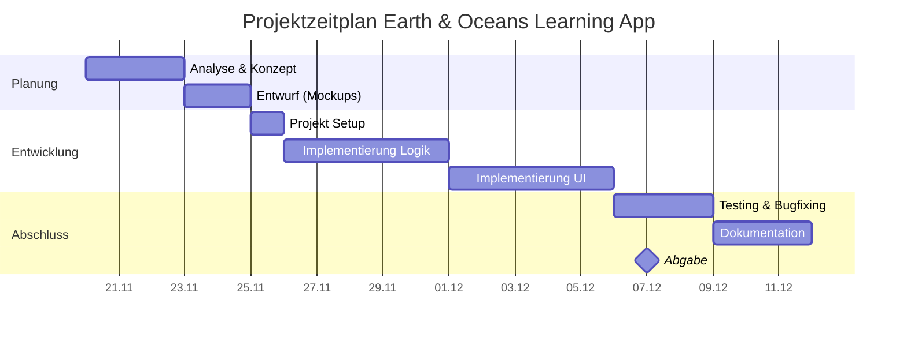
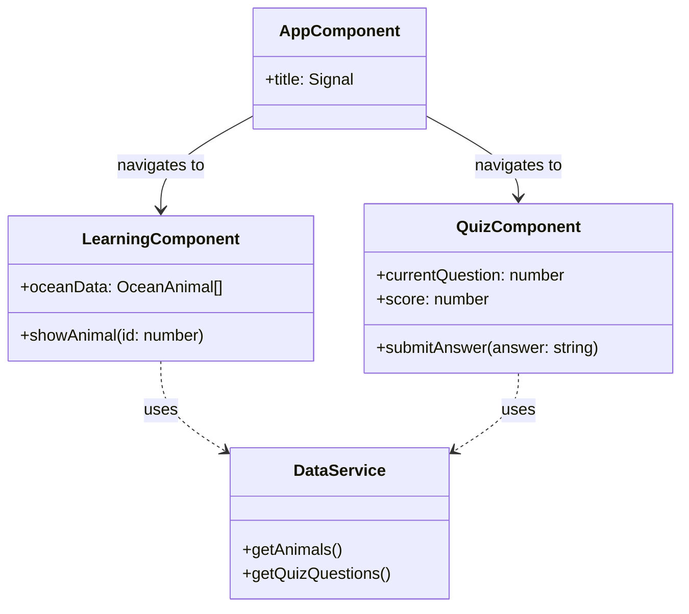

# Projektdokumentation zur Abschlussarbeit

**Thema:** Erstellung einer Lernanwendung mit Angular "Earth & Oceans Learning App"

**Prüfungsteilnehmer:** Adil [Nachname]
**Ausbilder:** Herr Ehlen
**Bildungsträger:** BitLC - Business IT Learning Center
**IHK:** Mittlerer Niederrhein
**Datum:** 07.12.2025

---

## Inhaltsverzeichnis

1. [Einleitung](#1-einleitung)
    1.1. [Problemstellung](#11-problemstellung)
    1.2. [Zielsetzung](#12-zielsetzung)
    1.3. [Abgrenzung](#13-abgrenzung)
2. [Projektplanung und -durchführung](#2-projektplanung-und-durchführung)
    2.1. [Projektphasen](#21-projektphasen)
    2.2. [Zeitplanung](#22-zeitplanung)
    2.3. [Anforderungsanalyse](#23-anforderungsanalyse)
3. [Entwurf](#3-entwurf)
    3.1. [Fachliches Design](#31-fachliches-design)
    3.2. [Technisches Design](#32-technisches-design)
4. [Realisierung](#4-realisierung)
5. [Testen](#5-testen)
6. [Fazit](#6-fazit)

---

## 1. Einleitung

### 1.1. Problemstellung
In der heutigen Zeit ist es wichtig, Kindern schon früh ein Bewusstsein für unsere Umwelt, speziell für die Ozeane, zu vermitteln. Viele Lernmaterialien sind jedoch trocken oder nicht kindgerecht aufbereitet. Es fehlt oft an interaktiven digitalen Möglichkeiten, die Kinder im Alter von 7 bis 9 Jahren spielerisch an dieses wichtige Thema heranführen.

### 1.2. Zielsetzung
Das Ziel meiner Abschlussarbeit ist die Entwicklung einer interaktiven "Single Page Application" (SPA) mit dem Namen **Earth & Oceans Learning App**. Die Anwendung soll Kindern spielerisch Wissen über Meeresbewohner und den Schutz der Ozeane vermitteln.
Zu den Kernfunktionen gehören:
- Ein Lernbereich mit kindgerechten Informationen.
- Ein interaktives Quiz, um das gelernt Wissen zu testen.
- Ein ansprechendes Design, das Spaß macht.

### 1.3. Abgrenzung
Im Rahmen dieses Abschlussprojektes wird eine reine Frontend-Anwendung erstellt. Es wird keine komplexe Backend-Anbindung mit Benutzerkonten oder Multiplayer-Funktionen geben. Der Fokus liegt auf der Erstellung einer funktionierenden, eigenständigen Lernanwendung im Browser, die später leicht erweitert werden kann (z.B. Integration in ein CMS).

## 2. Projektplanung und -durchführung

### 2.1. Projektphasen
Das Projekt wurde in folgende Phasen unterteilt:
1.  **Analyse:** Was genau soll gebaut werden? (Lastenheft/Pflichtenheft)
2.  **Entwurf:** Wie soll es aussehen und funktionieren? (Mockups, Architektur)
3.  **Implementierung:** Programmierung mit Angular.
4.  **Qualitätssicherung:** Testen der Funktionen.
5.  **Dokumentation:** Erstellen dieser Projektdokumentation.

### 2.2. Zeitplanung
Für das Projekt steht ein begrenzter Zeitraum zur Verfügung. Die Planung erfolgte mittels eines Balkendiagramms (Gantt-Chart), um sicherzustellen, dass alle Meilensteine rechtzeitig erreicht werden.


### 2.3. Anforderungsanalyse
Folgende Anforderungen wurden definiert:
- **Zielgruppe:** Kinder von 7-9 Jahren.
- **Technologie:** Angular (aktuelles Framework), HTML, CSS.
- **Plattform:** Lauffähig in allen modernen Browsern.
- **Design:** Bunt, große Knöpfe, wenig Text, viele Bilder.

## 3. Entwurf

### 3.1. Fachliches Design
Die Anwendung besteht aus einer Startseite, von der aus man in den "Lernen"-Bereich oder zum "Quiz" gelangt. Die Navigation soll so einfach wie möglich sein, damit Kinder sie intuitiv bedienen können.

```mermaid
usecaseDiagram
    actor "Kind (User)" as K
    
    package "Earth & Oceans App" {
        usecase "Lerninhalte ansehen" as UC1
        usecase "Quiz spielen" as UC2
        usecase "Fragen beantworten" as UC3
        usecase "Ergebnis sehen" as UC4
    }

    K --> UC1
    K --> UC2
    UC2 ..> UC3 : include
    UC2 ..> UC4 : include
```

### 3.2. Technisches Design
Als Framework habe ich **Angular** gewählt, da wir dies im Kurs intensiv behandelt haben und es sich hervorragend für strukturierte Single Page Applications eignet.
Die Struktur der Anwendung ist modular aufgebaut:
- `AppModule`: Hauptmodul
- `QuizComponent`: Für das Quiz-Logik
- `LearningComponent`: Für die Darstellung der Lerninhalte
- `DataService`: Um die Fragen und Texte zu laden (z.B. aus einer JSON-Datei).



## 4. Realisierung
Die Umsetzung startete mit der Generierung des Grundgerüsts mittels Angular CLI.
Ich habe darauf geachtet, sauberen Code zu schreiben und Komponenten wiederverwendbar zu machen. Besonders wichtig war mir, dass die Anwendung auch auf Tablets bedienbar ist, da Kinder oft Tablets nutzen.

### 4.1. Routing
Das Routing wurde so eingerichtet, dass die Startseite (`HomeController`) standardmäßig geladen wird.

```typescript
// app.routes.ts
export const routes: Routes = [
  { path: '', component: HomeComponent },
  { path: 'learning', component: LearningComponent },
  { path: 'quiz', component: QuizComponent },
  { path: '**', redirectTo: '' }
];
```

### 4.2. Datenhaltung (DataService)
Die Daten für die Meerestiere werden über einen zentralen Service bereitgestellt. Hierbei nutze ich Angular Signals für das Reaktivitäts-Management.

```typescript
// data.service.ts
@Injectable({ providedIn: 'root' })
export class DataService {
  // Beispielhafte Datenstruktur
  private animals = signal<OceanAnimal[]>([
    { id: 1, name: 'Delfin', info: 'Delfine sind sehr schlau...' },
    { id: 2, name: 'Hai', info: 'Haie haben viele Zähne...' }
  ]);

  getAnimals() {
    return this.animals.asReadonly();
  }
}
```

### 4.3. Quiz-Logik
Im Quiz-Component wird geprüft, ob die eingegebene Antwort korrekt ist. Auch hier kommen Signals zum Einsatz, um den aktuellen Punktestand sofort im UI anzuzeigen.

```typescript
// quiz.component.ts
export class QuizComponent {
  score = signal(0);
  currentQuestionIndex = signal(0);

  submitAnswer(isCorrect: boolean) {
    if (isCorrect) {
      this.score.update(s => s + 1);
      // Feedback: "Super gemacht!"
    } else {
      // Feedback: "Versuch es noch einmal!"
    }
    this.nextQuestion();
  }
}
```

## 5. Testen
Nach der Entwicklung wurden umfassende Blackbox-Tests durchgeführt, um die Funktionalität aus Sicht des Benutzers (des Kindes) zu validieren. Hierbei wurde ein Testprotokoll geführt.

### 5.1. Testprotokoll

| ID | Testfall | Vorbedingung | Schritte | Erwartetes Ergebnis | Status |
|----|----------|--------------|----------|---------------------|--------|
| **TF-01** | Navigation "Lernen" | App ist gestartet (Home) | Klick auf Button "Lernen starten" | Ansicht wechselt zur Lern-Übersicht, URL ändert sich zu `/learning` | [x] OK |
| **TF-02** | Navigation "Quiz" | App ist gestartet (Home) | Klick auf Button "Quiz starten" | Ansicht wechselt zum Quiz, erste Frage wird angezeigt | [x] OK |
| **TF-03** | Quiz: Richtige Antwort | Quiz läuft, Frage 1 angezeigt | Auswahl der korrekten Antwort (z.B. "Blauwal") | Feedback "Richtig!" erscheint, Button "Nächste Frage" wird aktiv, Punkte erhöhen sich | [x] OK |
| **TF-04** | Quiz: Falsche Antwort | Quiz läuft, Frage 1 angezeigt | Auswahl einer falschen Antwort | Feedback "Versuch es nochmal" erscheint, keine Punktevergabe | [x] OK |
| **TF-05** | Quiz: Abschluss | Letzte Frage beantwortet | Klick auf "Ergebnis sehen" | End-Screen erscheint mit Gesamtpunktzahl und Gratulation | [x] OK |
| **TF-06** | Responsives Design | Beliebige Seite | Fensterbreite auf < 600px verkleinern (Mobile) | Layout passt sich an, Elemente ordnen sich untereinander an, keine horizontalen Scrollbalken | [x] OK |
| **TF-07** | Fehlerhafte URL | App läuft | Eingabe von `/blabla` in Adresszeile | Automatische Weiterleitung zur Startseite (Wildcard Route) | [x] OK |

Alle definierten Testfälle wurden erfolgreich durchgeführt. Kritische Fehler traten in der finalen Version nicht mehr auf.

## 6. Fazit
### 6.1. Erreichte Ziele
Die "Earth & Oceans Learning App" konnte erfolgreich als Prototyp umgesetzt werden. Die geplanten Grundfunktionen (Lernen und Quiz) sind vorhanden und funktionstüchtig.

### 6.2. Ausblick
In Zukunft könnte die App um weitere Themengebiete (z.B. "Der Regenwald") erweitert werden. Auch eine Sprachausgabe für Texte wäre eine sinnvolle Ergänzung für die Zielgruppe.

### 6.3. Persönliches Fazit
Dieses Abschlussprojekt war eine tolle Gelegenheit, mein Wissen aus dem Angular-Kurs praktisch anzuwenden. Ich habe gelernt, wie wichtig eine gute Planung für den Erfolg eines Softwareprojekts ist.

### 6.4. Lessons Learned
Während des Projekts habe ich folgende wichtige Erfahrungen gesammelt, die ich in zukünftigen Projekten berücksichtigen werde:
- **Zeitmanagement:** Eine gute Planung ist essenziell, jedoch sollte man immer Pufferzeiten für unvorhergesehene Probleme einplanen.
- **Angular Signals:** Die Arbeit mit Signals ist sehr mächtig und vereinfacht das State-Management, erfordert jedoch anfangs ein Umdenken gegenüber der klassischen Change Detection.
- **CSS & Design:** Für ein kindgerechtes Design mit vielen Details muss deutlich mehr Zeit eingeplant werden als für Standard-Layouts.
- **Dokumentation:** Es ist sehr hilfreich, die Dokumentation parallel zur Entwicklung zu schreiben, anstatt alles am Ende nachzutragen.
